# Labelpepmatch

<br/>
<br/>
<br/>

## Table of Contents

  * [Introduction](#chapter-1)
  
    + [What is labelpepmatch?](#1.1)
    
    + [Some agreements on nomenclature](#1.2)
    
  * [Reading in data](#chapter-2)
  
    + [Data from different sources](#2.1)
    
    + [The design vector](#2.2)
    
    + [Reading in an example dataset](#2.3)
    
    + [Inspecting the `lpm_input` object](#2.4)
    
  * [Finding peak pairs](#chapter-3)
  
    + [Using the `pepmatch` function](#3.1)
    
    + [False discovery rate estimation](#3.2)
    
    + [The `pepmatched` object](#3.3)
    
    + [Cleaning your data](#3.4)
    
  * [Mass matching peak pairs to a database](#chapter-4) 
  
    + [Accessing databases of known peptides](#4.1)
    
    + [Generating a mock peptide database](#4.2)
    
    + [Mass matching peptides to a database](#4.3)
    
    + [Mass matching all features of a `pepmatched` object: the `pep.id` function.](#4.4)
    
    + [Visualising a `pepmatched` object with peptide identifications](#4.5)
    
  * [The view_spectra function](#chapter-5)
  
  * [Statistical analysis](#chapter-6)
  
    + [Generating a `statlist` object](#6.1)
    
    + [Looking at the `statlist` object](#6.2)
    
    + [MA-plots](#6.3)
    
    + [Linear models for comparing peptidomes](#6.4)
    
    + [Visualizing the statistics after analysis](#6.5)
    
  * [Further analysis with Bioconductor limma](#chapter-7)
  
    + [Bioconductor limma](#7.1)
    
    + [Linking labelpepmatch to limma](#7.2)
    
    + [Within run normalisation](#7.3)
    
    + [Between run normalisation](#7.4)
    

<br/>
<br/>
<br/>
<br/>
<br/>
  
   <a id="1.1"></a>


## 1. Introduction<a id="chapter-1"></a>
#### What is labelpepmatch?<a id="1.1"></a>
**Labelpepmatch (lpm)** is a package for the analysis and visualisation of labelled peptide mass spectrometry data. The labels should be stable isotopic tags, and the data should be peak lists of chromatography-MS, with peaks matched between runs (replicates). Since peptidomics datasets are complex and large, calculation times can sometimes be long. To this end, labelpepmatch is equipped with powerful parallel processing features.     
<br/>
<br/>
After installation, labelpepmatch can be loaded:


```
# Loading required package: lme4
# Loading required package: Matrix
# 
# Attaching package: 'Matrix'
# 
# The following objects are masked from 'package:base':
# 
#     crossprod, tcrossprod
# 
# Loading required package: Rcpp
```

```r
library(labelpepmatch)
```

Labelpepmatch contains a number of functions that will take you from a list of peaks (mass/charge, retention time, quantity) to a list of deconvoluted peak pairs, with the possibility of identification, visualisation and statistical analysis. Since different mass spectrometers produce different output, and since numerous good software packages for peak picking and chromatogram alignment are already around, this package offers a pipeline that starts where peak picking software stops. 
The input for this package is a list of peaks with their mass/charge ratio, their retention time and some quantitative measure (peak intensity or abundance). For easy data import, we provide two adaptors for common data formats (standard lpm and Progenesis LCMS). 
<br/>
This vignette shows how the package works, based on a real life example of neuropeptides extracted from the brain of the desert locust (*Schistocerca gregaria*), 
using the stable isotopic tag TMAB (trimethyl ammonium butyric acid). However, any source of peptides, and any stable isotopic tag can be used. 

#### Some agreements on nomenclature<a id="1.2"></a>
Every detected analyte within a mass spectrum will be called a **feature**. When two features appear to originate from the same peptide and only differ by their label, they will be called a **peak pair**.  
When looking for differences between two peptidomes, we compare a measure of the quantity of peptides between conditions. Different mass spectrometers measure this quantity in different ways (e.g. centroid vs profile). Sometimes the best measure is the height of peaks (intensity), sometimes the surface under peaks is used (abundance). In this document, this will always be called **quantity**, be it intensity or abundance. Oftentimes, output of peak picking software will contain both. Here, the preferred quantity measure can be given as an input parameter to the read functions. 
Throughout the entire pipeline, the samples where the first condition ("sol" in our example) is labelled with a light label are called **forward** and the samples where the first condition is labelled with a heavy label are called **reverse**. (see [`designvector`](#designvector)) When we use [limma](#chapter-8), the light labelled peptides will be called "red" (and are internally coded as labelled with cy5) and the heavy labelled peptides are called "green" (internally coded as labelled with cy3). 


## 2. Reading in data<a id="chapter-2"></a>

#### Data from different sources<a id="2.1"></a>
Within the package, the data class `lpm_input` is defined as an object that contains all the data, and some metadata like the number of runs, sample names and experiment design. The `lpm_input` object is the starting point for the pipeline of peak pair detection. It can be directly generated using the function `read.labelpepmatch`, or for standard output from the package progenesis LC-MS, we have an adaptor called `read.progenesis`. It is also possible to generate an `lpm_input` object from matched peak lists (`xcmsSet` object) from the R package xcms. Users of other peak picking software are kindly invited to contribute and extend this package with extra adaptors for other data formats. 


#### The design vector<a id="designvector"></a><a id="2.2"></a>
An important input parameter for the read functions is the design vector. This is a vector that contains in this exact order: name of first condition, name of second condition, labelling order of first sample, labelling order of second sample, ... labelling order of last sample. The labelling order can either be "F" (forward, first condition is light), or "R" (reverse, first condition is heavy). 
<br/>
For our locust dataset, the designvector looks like  `c("sol","greg","F","R","F","R","F,"R","F","R")`. 
This means that in the first sample, the "sol" condition is labelled with a light label, in the second, the "greg" condition is labelled with a light label, and so on. We would like to emphasize the importance of good experimental design with a balanced label swap. This is critical, since there is no way to tell apart label and condition effects if they are collinear. 

#### Reading in an example dataset<a id="2.3"></a>
For now, we will simply use one of the two example datasets^[Neuropeptides extracted from the corpora cardiaca of fifth instar nymphs of the desert locust *Schistocerca gregaria* under two rearing conditions: solitarious and gregarious, analyzed with ESI-Q-TOF. For details and another dataset on *C. elegans*, see Verdonck et al.] that are available within the package. If you want to read in your own data, use one of the read functions mentioned above. 


```r
schistocerca_tmab <- locustdata

# Of course, when reading in data on your own computer, reading in data
# would look something like this: (code not executed)

# indata <-'/filepath/to/dataset.csv/'

# samplenames <-c('A','B','C','D','E','F','G','H')

# designvector<-c('sol','greg','F','F','R','R','F','F','R','R')

# schistocerca_tmab<-read.labelpepmatch(indata,designvector=designvector,samplenames=samplenames)
```

Now, let's see what an `lpm_input` object looks like. As you will notice, this data is of class `lpm_input`, and it contains a data frame `schistocerca_tmab$frame` that contains all the data, accompanied by a namekey and the design vector. 


```r
class(schistocerca_tmab)
# [1] "lpm_input"
summary(schistocerca_tmab)
#        Length Class      Mode
# frame  26     data.frame list
# design  5     data.frame list
colnames(schistocerca_tmab$frame)
#  [1] "id"         "z"          "mz_1"       "mz_2"       "mz_3"      
#  [6] "mz_4"       "mz_5"       "mz_6"       "mz_7"       "mz_8"      
# [11] "Quantity_1" "Quantity_2" "Quantity_3" "Quantity_4" "Quantity_5"
# [16] "Quantity_6" "Quantity_7" "Quantity_8" "Ret_1"      "Ret_2"     
# [21] "Ret_3"      "Ret_4"      "Ret_5"      "Ret_6"      "Ret_7"     
# [26] "Ret_8"
```


#### Inspecting the `lpm_input` object<a id="2.4"></a>
Labelpepmatch also has an inbuild summary function^[The `lpm_summary` function is your best friend throughout the pipeline. It can be applied to any labelpepmatch specific class and will always give you an informative and oversightful overview of the object.] that summarizes the data in a somewhat more informative way. Notice that here, you get specific information about the structure of the data, the mass/charge ratios and the charges, the retention times etc. There is also a graphical output that will help you quickly visualize the data in the m/z and retention time dimensions. The parameter "run" determines which run is used for the graphical representation of the data. This can serve as a quick quality check per run before actually getting started with peak pair matching. If run is set to 0, a boxplot overview of all runs is given. 


```r
lpm_summary(schistocerca_tmab, run=0, graphics=T)
# 
#        Object of class "lpm_input"
# 
#        8 runs counted
# 
#        Design:
#   RunName LightCondition HeavyCondition Direction
# 1       A            sol           greg         F
# 2       B            sol           greg         F
# 3       C           greg            sol         R
# 4       D           greg            sol         R
# 5       E            sol           greg         F
# 6       F            sol           greg         F
# 7       G           greg            sol         R
# 8       H           greg            sol         R
#                                        FileName
# 1 exported_featuredata_schistoTMAB2011_2015.csv
# 2 exported_featuredata_schistoTMAB2011_2015.csv
# 3 exported_featuredata_schistoTMAB2011_2015.csv
# 4 exported_featuredata_schistoTMAB2011_2015.csv
# 5 exported_featuredata_schistoTMAB2011_2015.csv
# 6 exported_featuredata_schistoTMAB2011_2015.csv
# 7 exported_featuredata_schistoTMAB2011_2015.csv
# 8 exported_featuredata_schistoTMAB2011_2015.csv
# 
# 
#        Charge:
#    Min. 1st Qu.  Median    Mean 3rd Qu.    Max. 
#   1.000   2.000   2.000   2.586   3.000   6.000 
# 
# 
#        Mass/charge ratio:
#       mz_1             mz_2             mz_3             mz_4       
#  Min.   : 168.2   Min.   : 168.2   Min.   : 168.2   Min.   : 168.2  
#  1st Qu.: 621.3   1st Qu.: 621.3   1st Qu.: 621.3   1st Qu.: 621.3  
#  Median : 751.4   Median : 751.4   Median : 751.4   Median : 751.4  
#  Mean   : 799.7   Mean   : 799.7   Mean   : 799.7   Mean   : 799.7  
#  3rd Qu.: 948.5   3rd Qu.: 948.5   3rd Qu.: 948.5   3rd Qu.: 948.5  
#  Max.   :1981.0   Max.   :1981.0   Max.   :1981.0   Max.   :1981.0  
#       mz_5             mz_6             mz_7             mz_8       
#  Min.   : 168.2   Min.   : 168.2   Min.   : 168.2   Min.   : 168.2  
#  1st Qu.: 621.3   1st Qu.: 621.3   1st Qu.: 621.3   1st Qu.: 621.3  
#  Median : 751.4   Median : 751.4   Median : 751.4   Median : 751.4  
#  Mean   : 799.7   Mean   : 799.7   Mean   : 799.7   Mean   : 799.7  
#  3rd Qu.: 948.5   3rd Qu.: 948.5   3rd Qu.: 948.5   3rd Qu.: 948.5  
#  Max.   :1981.0   Max.   :1981.0   Max.   :1981.0   Max.   :1981.0  
# 
# 
#        Quantity:
#    Quantity_1       Quantity_2        Quantity_3       Quantity_4     
#  Min.   :     0   Min.   :      0   Min.   :     0   Min.   :      0  
#  1st Qu.:  1460   1st Qu.:      0   1st Qu.:  4384   1st Qu.:   4516  
#  Median :  6348   Median :   6576   Median : 10500   Median :  10888  
#  Mean   : 19633   Mean   :  19808   Mean   : 31381   Mean   :  37256  
#  3rd Qu.: 15668   3rd Qu.:  15028   3rd Qu.: 23896   3rd Qu.:  28892  
#  Max.   :729568   Max.   :1123488   Max.   :977376   Max.   :1697048  
#    Quantity_5        Quantity_6        Quantity_7        Quantity_8     
#  Min.   :      0   Min.   :      0   Min.   :      0   Min.   :      0  
#  1st Qu.:   3344   1st Qu.:   3296   1st Qu.:   2720   1st Qu.:   3876  
#  Median :   7788   Median :   6412   Median :   5128   Median :   7492  
#  Mean   :  29628   Mean   :  24380   Mean   :  23608   Mean   :  27555  
#  3rd Qu.:  19388   3rd Qu.:  14712   3rd Qu.:  12272   3rd Qu.:  17708  
#  Max.   :1314748   Max.   :1484884   Max.   :1314056   Max.   :1588028  
# 
# 
#        Retention time:
#      Ret_1           Ret_2           Ret_3           Ret_4      
#  Min.   :12.69   Min.   :13.09   Min.   :12.85   Min.   :12.83  
#  1st Qu.:23.86   1st Qu.:23.85   1st Qu.:23.75   1st Qu.:23.55  
#  Median :26.94   Median :26.92   Median :26.84   Median :27.21  
#  Mean   :26.59   Mean   :26.66   Mean   :26.54   Mean   :26.71  
#  3rd Qu.:29.85   3rd Qu.:29.94   3rd Qu.:29.78   3rd Qu.:30.17  
#  Max.   :47.38   Max.   :47.82   Max.   :47.40   Max.   :47.43  
#      Ret_5           Ret_6           Ret_7           Ret_8      
#  Min.   :13.09   Min.   :12.77   Min.   :12.72   Min.   :12.79  
#  1st Qu.:24.13   1st Qu.:23.72   1st Qu.:23.75   1st Qu.:23.86  
#  Median :27.22   Median :26.84   Median :26.90   Median :26.94  
#  Mean   :26.87   Mean   :26.52   Mean   :26.56   Mean   :26.60  
#  3rd Qu.:30.08   3rd Qu.:29.77   3rd Qu.:29.86   3rd Qu.:29.85  
#  Max.   :47.86   Max.   :47.52   Max.   :47.63   Max.   :47.49
```

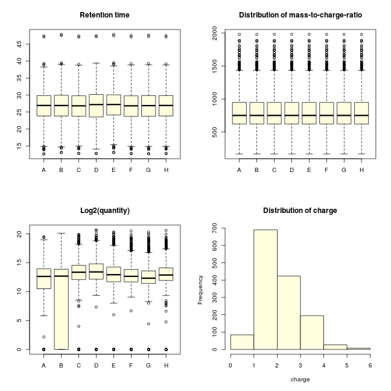 

Notice that the output is rather extensive and consists of basic information on experiment design, origin of the data and some summary statistics of the data. The figures give a more graphical overview of the specific run.^[If one wants to compare multiple runs graphically without graphic output in the terminal, the `lpm_summary` function can be run with `printoutput=F`] 


```r
lpm_summary(schistocerca_tmab, run=2, graphics=T, printoutput=F)
```

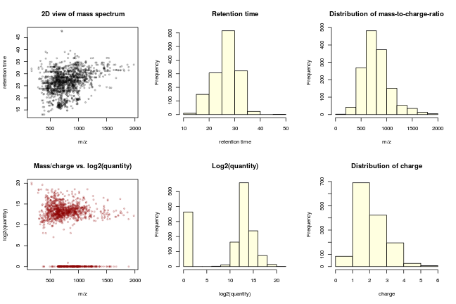 

Some observations that can be made here:

- The histograms in the upper row can be considered marginal projections on the axes of the first figure, which is a typical "top view" of the data. We observe that most analytes eluted in the first half of the chromatography, with a clear maximum between 25 and 30 minutes. Also the observed pattern of m/z is typical for a mixture of peptides analyzed with ESI-Q-TOF

- <a id="quantdistr"></a>The quantity is an almost symmetric distribution on a log2 scale and there is no clear correllation between mass/charge ratio and quantity. Especially in run B there is a large proportion of features with very low quantity. One can remedy this by only using features that are above a certain quantity threshold. 

- The charges seem to be Poisson-like distributed starting at 2 charges. Single charged analytes are uncommon.^[In the preprocessing of the data, most single charged features were discarded because the ESI-Q-TOF spectrum originally contained a lot of single charged contaminations. Only single charged features that were very clearly peptides were retained]


## 3. Finding peak pairs<a id="chapter-3"></a>
#### Using the `pepmatch` function<a id="3.1"></a>
The core function of the labelpepmatch package is `pepmatch`. This function interprets an `lpm_input` object, and will search for peak pairs within the data. The label that we used in this example (TMAB) is hard-coded in the package, but any label mass can be given as an input parameter. Also, users are invited to extend the list of hard-coded labels in further versions of this package. 


```r
matched <- pepmatch(lpm_input = schistocerca_tmab, elutionthresh = 0.3, labelthresh = 0.05, 
    labelcountmax = 5, label = "TMAB", minmolweight = 132, quantmin = 2000, 
    FDR = T, iterations = 10, cores = 1)
```

A rather high number of parameters for peak pair detection can be tweaked. The two most important ones are the thresholds for mass and retention time. `elutionthresh` is the maximal allowed difference between retention times of two features to be considered a peak pair. Since the labels that we use are supposed to be chemically equivalent, the peak pairs should in theory co-elute. `labelthresh` is the maximal allowed deviation from the theoretical mass difference between two labelled peptides. So if the mass difference between two labels is 10.00, and you get two co-eluting peaks with masses 100.00 and 110.05, they will be considered a peak pair if `labelthresh >= 0.05`. For multiple labels, this threshold is not multiplied. So for the same example, two peaks of 100.00 and 120.09 will not be considered a peak pair if `labelthresh==0.05`. Further, we set some restrictions to the molecular weigth (at least the smallest possible dipeptide glycineglycine), number of labels (5 positions for a label to bind to is a lot for a neuropeptide), and the minimal quantity of signal for at least one feature within a peak pair. There will always be the inevitable trade-off between losing real positives and keeping false positives. Hence, the stringency of the peak pair detection parameters should be meticulously selected based on the specifications of the device used. Other cut-offs (quantity, mass, ...) can be based on the numbers and kinds of peptides that are expected, and some prior information like the [distribution of quantities](#quantdistr). It is noteworthy that taking a large fraction of "uninteresting" peak pairs along throughout the analysis, will lead to multiple testing issues, and in the end will dilute the power to detect real differences between conditions. 


#### False discovery rate estimation<a id="3.2"></a>
The pepmatch function also contains a false discovery rate estimation. This should give an idea of how well you can trust the peak pairs that you do find. Here a mock dataset will be created and exactly the same peak pair search procedure with the same detection parameters will then be executed. The mock data are generated according to a restricted randomization procedure that produces mock data with a very comparable structure to the original data. Structure elements that are retained are:  

- the dispersion of features in the retention time - m/z space

- the structure of decimals for m/z. This is important because decimals are non random in m/z data. 

Note that estimating a false discovery rate in highly structured data is difficult. We suspect that our FDR estimates are on the conservative side, but we will only gain full understanding of this once multiple real datasets with varying degrees of structure are being subjected to these analyses. The FDR estimation can be ran in multiple iterations in order to get better estimates of the false discovery rate. Note however that for larger datasets, multiple iterations may dramatically slow down your analyses. For more information on mock data generation, we refer to the `lpm_mockdata` function.

#### The `pepmatched` object<a id="3.3"></a>
The `pepmatch` function outputs an object of class `pepmatched`. This object contains a list of data frames with peak pairs for each separate run, the parameters used for the peak pair detection, information about FDR (if FDR=T) and some other metadata. A quick look into the structure of the object:


```r
# A summary shows which slots there are in our object
# Notice that the first eight slots correspond to the runs
summary(matched)
#                      Length Class      Mode
# matchlist_A          24     data.frame list
# matchlist_B          24     data.frame list
# matchlist_C          24     data.frame list
# matchlist_D          24     data.frame list
# matchlist_E          24     data.frame list
# matchlist_F          24     data.frame list
# matchlist_G          24     data.frame list
# matchlist_H          24     data.frame list
# design                5     data.frame list
# pepmatch_parameters   8     data.frame list
# pepmatch_FDR_summary 13     data.frame list
# pepmatch_FDR_details  3     -none-     list

# A closer look at one of these matchlists:
# Notice that since a 'pepmatched' object is a list,
# you need double brackets for indexing. 
knitr::kable(head(matched[[1]],3),digits=3)
```


|   |ID          |samplename_L |  ID_L| z_L|    mz_L| quant_L|  ret_L|     m_L|samplename_H |  ID_H| z_H|    mz_H| quant_H|  ret_H|     m_H|      MW| labelcount| precision|isID |pepID |pepseq |pepmass |delta_m | N_identifications|
|:--|:-----------|:------------|-----:|---:|-------:|-------:|------:|-------:|:------------|-----:|---:|-------:|-------:|------:|-------:|-------:|----------:|---------:|:----|:-----|:------|:-------|:-------|-----------------:|
|6  |36058_36059 |NA           | 36058|   1| 423.355|   89072| 31.457| 422.348|NA           | 36059|   1| 432.413|  235324| 31.457| 431.405| 295.239|          1|     0.002|NA   |NA    |NA     |NA      |NA      |                 0|
|2  |36056_36057 |NA           | 36056|   1| 458.321|  324800| 30.738| 457.314|NA           | 36057|   1| 467.377|  215192| 30.738| 466.370| 330.204|          1|     0.001|NA   |NA    |NA     |NA      |NA      |                 0|
|1  |36212_36213 |NA           | 36212|   1| 527.329|  116024| 30.706| 526.322|NA           | 36213|   1| 536.390|   19752| 30.706| 535.383| 399.214|          1|     0.006|NA   |NA    |NA     |NA      |NA      |                 0|

A quick look at the first run within our `pepmatched` object. 

- Every peak pair gets an ID which is just the concatenation of the two feature ID's

- "_L" in a column name means a property of the light labelled feature within the peak pair, "_H" is a property of the heavy labelled feature. 

- Note that the deconvolution mz*z is not the same as the MW, because of the presence of labels. 

- The precision column is the deviation between theoretical and observed mass difference within the peak pair. It is bounded by the `labelthresh` parameter of the `pepmatch` function. 

- The last 6 columns are all empty now since our peak pairs have yet to be matched to a database. 


Again, you can use the `lpm_summary` function to summarize all the information from this new object in a sensible and oversightful way. 


```r
lpm_summary(matched, run=1, graphics=T)
# 
#        Object of class "pepmatched" with 8 runs:
#        -----------------------------------------
# Peptides not identified
# parameters used for matching peak pairs:
# 
# elution threshold:         0.3
# label threshold:           0.05
# maximal number of labels:  5
# light label mass:          128.1177
# heavy label mass:          137.1728
# label name:                TMAB
# minimum molecular weight:  132
# minimum quantity:          2000
# Peak pair detection FDR:   T  
# 
# 
# run: 1
#    Name: A   Direction: Forward
#    Number of peak pairs found     : 107
#    Peak pair detection FDR        : 9.5   (8.9 %)
#    Distribution of deconvoluted MW: 
#    Min. 1st Qu.  Median    Mean 3rd Qu.    Max. 
#   295.2  1080.0  1451.0  1631.0  1919.0  3803.0 
# 
# 
# run: 2
#    Name: B   Direction: Forward
#    Number of peak pairs found     : 104
#    Peak pair detection FDR        : 7.3   (7 %)
#    Distribution of deconvoluted MW: 
#    Min. 1st Qu.  Median    Mean 3rd Qu.    Max. 
#   295.2  1038.0  1357.0  1599.0  1904.0  3355.0 
# 
# 
# run: 3
#    Name: C   Direction: Reverse
#    Number of peak pairs found     : 122
#    Peak pair detection FDR        : 9   (7.4 %)
#    Distribution of deconvoluted MW: 
#    Min. 1st Qu.  Median    Mean 3rd Qu.    Max. 
#   295.2  1130.0  1513.0  1706.0  2094.0  3803.0 
# 
# 
# run: 4
#    Name: D   Direction: Reverse
#    Number of peak pairs found     : 122
#    Peak pair detection FDR        : 6.5   (5.3 %)
#    Distribution of deconvoluted MW: 
#    Min. 1st Qu.  Median    Mean 3rd Qu.    Max. 
#   295.2  1130.0  1496.0  1686.0  2094.0  3803.0 
# 
# 
# run: 5
#    Name: E   Direction: Forward
#    Number of peak pairs found     : 118
#    Peak pair detection FDR        : 7   (5.9 %)
#    Distribution of deconvoluted MW: 
#    Min. 1st Qu.  Median    Mean 3rd Qu.    Max. 
#   295.2  1104.0  1617.0  1725.0  2111.0  3803.0 
# 
# 
# run: 6
#    Name: F   Direction: Forward
#    Number of peak pairs found     : 122
#    Peak pair detection FDR        : 8.9   (7.3 %)
#    Distribution of deconvoluted MW: 
#    Min. 1st Qu.  Median    Mean 3rd Qu.    Max. 
#   295.2  1104.0  1507.0  1690.0  2003.0  3803.0 
# 
# 
# run: 7
#    Name: G   Direction: Reverse
#    Number of peak pairs found     : 119
#    Peak pair detection FDR        : 8   (6.7 %)
#    Distribution of deconvoluted MW: 
#    Min. 1st Qu.  Median    Mean 3rd Qu.    Max. 
#   295.2  1113.0  1513.0  1680.0  1992.0  3803.0 
# 
# 
# run: 8
#    Name: H   Direction: Reverse
#    Number of peak pairs found     : 117
#    Peak pair detection FDR        : 9.4   (8 %)
#    Distribution of deconvoluted MW: 
#    Min. 1st Qu.  Median    Mean 3rd Qu.    Max. 
#   295.2  1130.0  1513.0  1696.0  2059.0  3803.0
```

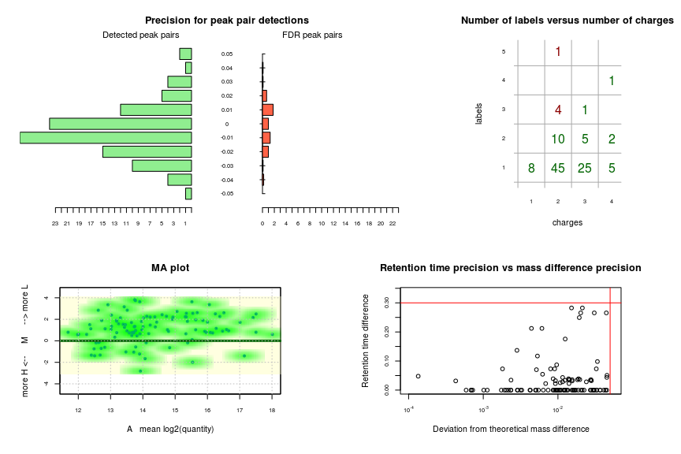 
Note that the observed mass precision for peak pair detection is a symmetric distribution with the maximum around 0 and bilaterally bounded by `labelthresh`. Systematic error, if any, turns out to be minor. Notice that also for the false discovery rate tested peak pairs, the distribution is not uniform. This is expected since mock features in the mock database look like real labelled peptides and hence their masses are non random.
<br/>

The next panel shows a table of the number of charges versus the number of labels, bounded by `labelcountmax`. No peak pairs with more than 5 charges were found. Most peak pairs have two or three charges and one or two labels. Note that a minor proportion of detected peak pairs have more labels than charges (indicated in red), which for TMAB is physically impossible. No doubt these are false positives. We will remove them in a next step. 
<br/>

Next, there is an MA plot where you see that there is a tendency for the ligth labelled channel to have a higher signal. See [lpm_MAplot](#MAplot) for more information. 

The last panel shows a plot of the retention time precision (bounded by `elutionthresh`) versus the mass difference precision (bounded by `labelthresh`). Correct interpretation of this figure can lead to better estimation on parameter stringency. For example: here we see that most peak pairs seem to have co-eluted perfectly simultaneously, while the deviation from the expected mass difference is distributed more evenly over the x-axis. However, in the peak pairs with a larger retention time difference, there is a trend towards having a larger deviation from the theoretical mass difference. So perhaps we have chosen our `elutionthresh` on the high side.
If after inspection of the matched object, one would want to adjust some of the thresholds of the `pepmatch` function, the function does not have to be repeated. Instead, the much quicker function `lpm_refine` can be used. 

#### Cleaning your data<a id="3.4"></a>


```r
matched<-lpm_refine(matched,elutionthresh=0.15)
```
And have a look at the output again (this time without printing in the terminal).

```r
lpm_summary(matched, printoutput = F, run=1, graphics=T)
```

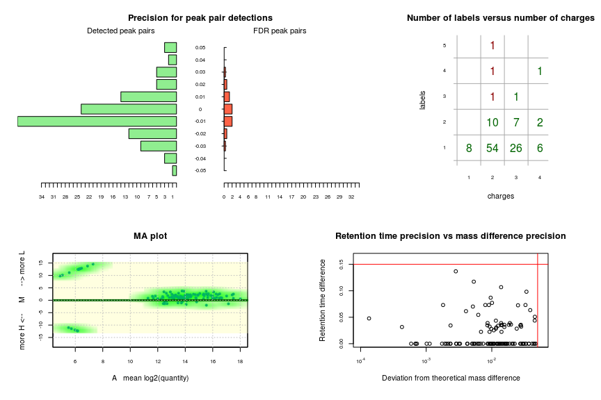 

Note that compared with the first version of our `pepmatched` object, 24 out of 202 features were discarded, among them, 4 out of 10 features with more labels than charges disappeared, which is another confirmation that we were mainly discarding false positives. Since we expect all of them to be false positives anyway, we can do:


```r
matched<-lpm_refine(matched,remove.more.labels.than.charges =T)
```


## 4. Mass matching peak pairs to a database<a id="chapter-4"></a>

#### Accessing databases of known peptides<a id="4.1"></a>
This package contains a couple of functions designed to work with databases of known peptides. The main identification function is `pep.id` which takes an object of class `pepmatched`, but let's first begin with a couple of examples of smaller functions. For example, we can calculate the molecular weight of a given peptide. Notice this is the monoisotopic mass, not the average molar mass. 


```r
calculate_peptide_mass("SVPFKPRLa")
# [1] 941.5858
```

There is also a function for downloading databases from our website. As an example we download the desert locust peptide database. 

```r
db<-download_lpm_db("desertlocust")
# And show what one line of database looks like. 
# For example Schistocerca sulfakinin. 
# Note that we introduced the $ sign for a sulfotyrosin residue. 
db[38,]
#      name       MW       sequence     family        reference
# 38 Scg-SK 1500.579 pQJASDD$GHMRFa Sulfakinin Clynen & Schoofs
```

And a function to quality check this database. This function recalculates all molecular weights of the database and compares them to the database molecular weights. In our database, there are two clear mismatches that after closer investigation appear to be sequences where the MW is known from mass spectrometry, but the whole sequence is unknown. 


```r
QC_database(db)
```

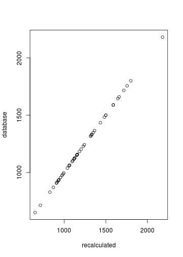 

```
#  [1]  2.273737e-13  2.273737e-13  0.000000e+00  0.000000e+00  0.000000e+00
#  [6]  0.000000e+00  2.273737e-13  4.547474e-13 -1.136868e-13  0.000000e+00
# [11] -1.136868e-13 -1.136868e-13  0.000000e+00  0.000000e+00  0.000000e+00
# [16]  0.000000e+00  0.000000e+00 -1.136868e-13  2.273737e-13  2.273737e-13
# [21]  2.273737e-13  0.000000e+00  0.000000e+00  0.000000e+00  0.000000e+00
# [26]  0.000000e+00  2.273737e-13  0.000000e+00 -1.136868e-13  2.273737e-13
# [31]  0.000000e+00 -1.136868e-13  0.000000e+00  0.000000e+00  2.273737e-13
# [36]  0.000000e+00  0.000000e+00  0.000000e+00  0.000000e+00 -1.136868e-13
# [41] -1.136868e-13  0.000000e+00  0.000000e+00  0.000000e+00  2.273737e-13
# [46]  0.000000e+00  0.000000e+00  0.000000e+00  0.000000e+00  0.000000e+00

## And have a look at the mismatches:
db[31:32,]
#        name       MW  sequence     family     reference
# 31 Scg-PK-6 829.4857 ?PTFTPRJa Pyrokinins Clynen et al.
# 32 Scg-PK-7 714.4224  ?PFSPRJa Pyrokinins Clynen et al.
```

#### Generating a mock peptide database<a id="4.2"></a>
It is also possible to generate a mock database of peptides with a restricted randomization procedure that shuffels the amino acids of the input database over its peptide length distribution. It also respects the N-terminal pyroglutamination and C-terminal amidation frequencies. If we plot the sorted molecular weights of the mock database on the sorted molecular weights of the input database, we expect them to reside approximately on y=x. The `generate_random_db` function will be used in the false discovery estimation of `pep.id`. 


```r

randomdb<-generate_random_db(db,plot=T)
```

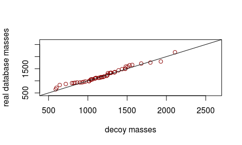 

#### Mass matching peptides to a database<a id="4.3"></a>
Sometimes one just wants to quickly mass match a putative peptide with a given molecular weight to a database of known peptides. This is where the `pep.massmatch` function comes out handy. Remember we have a database of desert locust peptides. We will now check if two analytes with molecular weights 1080.25 and 1500.58 can be matched to known peptides within a 0.1 Dalton interval. 


```r
pep.massmatch(input = c(1080.25, 1500.6), db = db, ID_thresh = 0.1)
```

|      MW| N_identifications|pepID  |pepseq         |  pepmass|   delta_m|isID |
|-------:|-----------------:|:------|:--------------|--------:|---------:|:----|
| 1080.25|                NA|NA     |NA             |       NA|        NA|NA   |
| 1500.61|                NA|Scg-SK |pQJASDD$GHMRFa | 1500.579| -0.031161|NA   |

And we see that no match is found for the first mass, but the second one gets to be matched to sulfakinin. This function also has an FDR estimation based on the `generate_random_db` function, and an optional correction for systematic bias based on identifications. Caution should however be payed here, since this will only work with a sufficiently high number of real matches. This rather sketchy feature should be considered something interesting to have a look at, rather than a have-to-do. 

#### Mass matching all features of a `pepmatched` object: the `pep.id` function. <a id="4.4"></a>

As mentioned earlier, the identification function that takes a `pepmatched` object as input and hence fits right in the pipeline is `pep.id`. The parameter `ID_thresh` is just the maximum allowed difference between two masses for mass match. The database can either be an object from the environment, but it can also be a preset database, or a local one. So the two snippets of code shown will yield exactly the same results since the database that we read in earlier is the same as the preset database that is directly read from the `pep.id` function. 
Finally, we here choose for 100 iterations of false discovery rate estimation. This means that for each run, 100 different databases will be generated with the `generate_random_db` function, and in each of them the identification frequency is recorded. This will yield a good estimate of the false discovery rate in a random peptide database. 


```r
matched_id <- pep.id(pepmatched = matched, ID_thresh = 0.1, db = db, cores = 1, 
    FDR = T, iterations = 3)
```


```r
matched_id <- pep.id(pepmatched = matched, ID_thresh = 0.1, presetdb = "desertlocust", 
    cores = 1, FDR = T, iterations = 100)
```


#### Visualising a `pepmatched` object with peptide identifications <a id="4.5"></a>
The output of this function will still be of the same `pepmatched` class, but will now contain identification information. This also implies that identifications are not necessary for further downstream statistical analysis. More details about identifications can be found by having a closer look at the object: 


```r
lpm_summary(matched_id, printoutput = T, run=1, graphics=T)
# 
#        Object of class "pepmatched" with identified peptides and 8 runs:
#        -----------------------------------------------------------------
# ID threshold used for peptide identification: 0.1
# 
# Identified peptides:
#                  idpep Freq
# 1        Scg-AKH-JP-1    8
# 2        Scg-AKH-JP-2    8
# 3           Scg-FLRFa    8
# 4  Scg-IRP-co-peptide    8
# 5  Scg-ITP-co-peptide    4
# 6            Scg-OK-1    8
# 7            Scg-PK-1    8
# 8            Scg-PK-4    8
# 9            Scg-PK-5    8
# 10          Scg-PKL-2    8
# 11           Scg-TK-3    8
# 
# 
# parameters used for matching peak pairs:
# 
# elution threshold:         0.15
# label threshold:           0.05
# maximal number of labels:  5
# light label mass:          128.1177
# heavy label mass:          137.1728
# label name:                1
# minimum molecular weight:  132
# minimum quantity:          2000
# Peak pair detection FDR:   12.16
# 
# 
# run: 1
#    Name: A   Direction: Forward
#    Number of peak pairs found       : 96
#    Peak pair detection FDR          : 9.5	(8.9 %)
#    Number of peptide identifications: 14
#    Peptide identification FDR       : 2	(14.3 %)
#    Distribution of deconvoluted MW: 
#    Min. 1st Qu.  Median    Mean 3rd Qu.    Max. 
#   295.2  1136.0  1482.0  1674.0  1957.0  3803.0 
# 
# 
# run: 2
#    Name: B   Direction: Forward
#    Number of peak pairs found       : 93
#    Peak pair detection FDR          : 7.3	(7 %)
#    Number of peptide identifications: 14
#    Peptide identification FDR       : 0.7	(4.8 %)
#    Distribution of deconvoluted MW: 
#    Min. 1st Qu.  Median    Mean 3rd Qu.    Max. 
#   295.2  1130.0  1513.0  1666.0  2059.0  3355.0 
# 
# 
# run: 3
#    Name: C   Direction: Reverse
#    Number of peak pairs found       : 107
#    Peak pair detection FDR          : 9	(7.4 %)
#    Number of peptide identifications: 13
#    Peptide identification FDR       : 2	(15.4 %)
#    Distribution of deconvoluted MW: 
#    Min. 1st Qu.  Median    Mean 3rd Qu.    Max. 
#   295.2  1161.0  1589.0  1765.0  2232.0  3803.0 
# 
# 
# run: 4
#    Name: D   Direction: Reverse
#    Number of peak pairs found       : 109
#    Peak pair detection FDR          : 6.5	(5.3 %)
#    Number of peptide identifications: 14
#    Peptide identification FDR       : 0.7	(4.8 %)
#    Distribution of deconvoluted MW: 
#    Min. 1st Qu.  Median    Mean 3rd Qu.    Max. 
#   295.2  1158.0  1513.0  1746.0  2245.0  3803.0 
# 
# 
# run: 5
#    Name: E   Direction: Forward
#    Number of peak pairs found       : 107
#    Peak pair detection FDR          : 7	(5.9 %)
#    Number of peptide identifications: 14
#    Peptide identification FDR       : 1.3	(9.5 %)
#    Distribution of deconvoluted MW: 
#    Min. 1st Qu.  Median    Mean 3rd Qu.    Max. 
#   295.2  1140.0  1645.0  1774.0  2336.0  3803.0 
# 
# 
# run: 6
#    Name: F   Direction: Forward
#    Number of peak pairs found       : 109
#    Peak pair detection FDR          : 8.9	(7.3 %)
#    Number of peptide identifications: 15
#    Peptide identification FDR       : 3	(20 %)
#    Distribution of deconvoluted MW: 
#    Min. 1st Qu.  Median    Mean 3rd Qu.    Max. 
#   295.2  1141.0  1541.0  1750.0  2146.0  3803.0 
# 
# 
# run: 7
#    Name: G   Direction: Reverse
#    Number of peak pairs found       : 105
#    Peak pair detection FDR          : 8	(6.7 %)
#    Number of peptide identifications: 14
#    Peptide identification FDR       : 2.3	(16.7 %)
#    Distribution of deconvoluted MW: 
#    Min. 1st Qu.  Median    Mean 3rd Qu.    Max. 
#   295.2  1139.0  1541.0  1736.0  2112.0  3803.0 
# 
# 
# run: 8
#    Name: H   Direction: Reverse
#    Number of peak pairs found       : 107
#    Peak pair detection FDR          : 9.4	(8 %)
#    Number of peptide identifications: 14
#    Peptide identification FDR       : 1.7	(11.9 %)
#    Distribution of deconvoluted MW: 
#    Min. 1st Qu.  Median    Mean 3rd Qu.    Max. 
#   295.2  1140.0  1541.0  1744.0  2129.0  3803.0
```

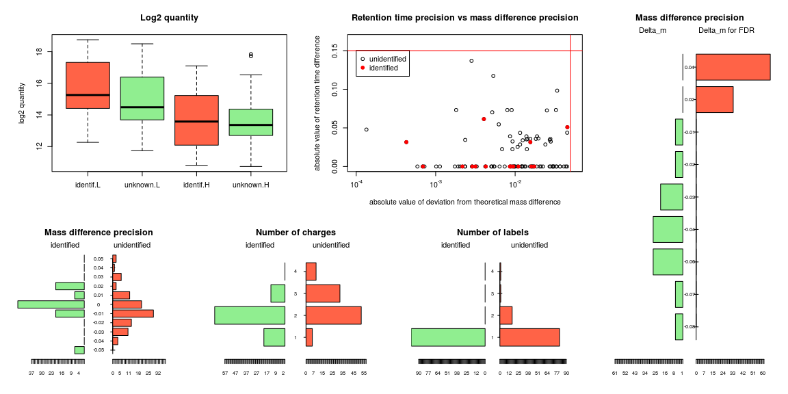 
A total of 14 different neuropeptides have been mass matched to peak pairs, 12 of which in all runs. The estimated false discovery rate is around 20%. If identifications are considered a strong signal for genuine labelled peptides, it is interesting to remark that we observe the identified peptides to have a slightly higher quantity, both for light and heavy labelled peptides. Notice that the bias for the light labelled peptides to have a higher quantity is also clearly visible. Also we observe that most of the identified peptides appear to have very minor differences in retention time within the peak pair. 

Identified peptides have charges between one and three with a preference for double charges, and one single label. Looking deeper in the data, we notice that the same peptides are found both in single, double and triple charged form:


```r
# The first element of a 'pepmatched' object is 
# a dataframe with all the peak pairs of run 1.
# We select only the rows that contain
# identified peak pairs. 

 knitr::kable(matched_id[[1]][matched_id[[1]]$isID==T,],digits=3)
```


|   |ID          |samplename_L |  ID_L| z_L|     mz_L| quant_L|  ret_L|      m_L|samplename_H |  ID_H| z_H|     mz_H|    quant_H|  ret_H|      m_H|       MW| labelcount| precision|isID |pepID              |pepseq            |  pepmass| delta_m| N_identifications|
|:--|:-----------|:------------|-----:|---:|--------:|-------:|------:|--------:|:------------|-----:|---:|--------:|----------:|------:|--------:|--------:|----------:|---------:|:----|:------------------|:-----------------|--------:|-------:|-----------------:|
|11 |36145_36143 |NA           | 36145|   2|  530.813|  230228| 21.625| 1059.611|NA           | 36143|   2|  535.342|  37796.000| 21.625| 1068.670|  932.503|          1|     0.003|TRUE |Scg-PK-4           |EGDFTPRLa         |  932.476|  -0.026|                 1|
|67 |371_36110   |NA           |   371|   2|  596.355|   24764| 33.801| 1190.696|NA           | 36110|   2|  600.882|   2417.318| 33.832| 1199.750| 1063.585|          1|     0.000|TRUE |Scg-TK-3           |APQAGFYGVRa       | 1063.561|  -0.024|                 1|
|5  |36070_36071 |NA           | 36070|   1| 1257.760|  143180| 30.738| 1256.753|NA           | 36071|   1| 1266.817|  74764.000| 30.738| 1265.810| 1129.643|          1|     0.002|TRUE |Scg-IRP-co-peptide |pQSDLFLLSPK       | 1129.605|  -0.039|                 1|
|57 |36206_40    |NA           | 36206|   2|  629.387|  245016| 30.738| 1256.759|NA           |    40|   2|  633.915| 140908.000| 30.738| 1265.815| 1129.649|          1|     0.001|TRUE |Scg-IRP-co-peptide |pQSDLFLLSPK       | 1129.605|  -0.045|                 1|
|14 |36176_36178 |NA           | 36176|   2|  656.387|  442860| 22.376| 1310.759|NA           | 36178|   2|  660.922|  78320.000| 22.376| 1319.830| 1183.657|          1|     0.016|TRUE |Scg-PK-1           |GAAPAAQFSPRLa     | 1183.651|  -0.006|                 1|
|83 |36219_1303  |NA           | 36219|   3|  457.610|   33452| 27.009| 1369.809|NA           |  1303|   3|  460.625|  13688.000| 27.009| 1378.854| 1242.693|          1|    -0.011|TRUE |Scg-FLRFa          |PDVDHVFLRFa       | 1242.656|  -0.038|                 1|
|8  |36250_36260 |NA           | 36250|   1| 1444.721|   19312| 32.298| 1443.714|NA           | 36260|   1| 1453.772|  12260.000| 32.298| 1452.765| 1316.601|          1|    -0.004|TRUE |Scg-AKH-JP-1       |DAADFGDPYSFL      | 1316.561|  -0.041|                 1|
|64 |36262_36265 |NA           | 36262|   2|  722.871|   51824| 32.298| 1443.727|NA           | 36265|   2|  727.403|  32872.000| 32.298| 1452.791| 1316.621|          1|     0.009|TRUE |Scg-AKH-JP-1       |DAADFGDPYSFL      | 1316.561|  -0.060|                 1|
|7  |36254_36261 |NA           | 36254|   1| 1451.736|    4932| 31.846| 1450.729|NA           | 36261|   1| 1460.783|   3312.000| 31.846| 1459.775| 1323.614|          1|    -0.009|TRUE |Scg-AKH-JP-2       |YADPNADPMAFL      | 1323.585|  -0.029|                 1|
|60 |36249_36246 |NA           | 36249|   2|  726.387|   17004| 31.846| 1450.759|NA           | 36246|   2|  730.910|   9960.000| 31.846| 1459.805| 1323.644|          1|    -0.009|TRUE |Scg-AKH-JP-2       |YADPNADPMAFL      | 1323.585|  -0.059|                 1|
|48 |231_1970    |NA           |   231|   2|  858.963|   31460| 28.856| 1715.911|NA           |  1970|   2|  863.468|   4368.000| 28.907| 1724.921| 1588.778|          1|    -0.045|TRUE |Scg-OK-1           |NFDEIDRSGFSGFV    | 1588.721|  -0.058|                 1|
|49 |36015_127   |NA           | 36015|   2|  886.991|  187480| 28.856| 1771.968|NA           |   127|   2|  891.520|  38964.000| 28.856| 1781.026| 1644.859|          1|     0.003|TRUE |Scg-PK-5           |DSSEDWAQPFVPRLa   | 1644.794|  -0.065|                 1|
|91 |271_36140   |NA           |   271|   3|  591.664|   39260| 28.856| 1771.971|NA           | 36140|   3|  594.688|   8092.000| 28.856| 1781.043| 1644.869|          1|     0.017|TRUE |Scg-PK-5           |DSSEDWAQPFVPRLa   | 1644.794|  -0.074|                 1|
|68 |36133_641   |NA           | 36133|   2|  942.602|   53936| 33.801| 1883.189|NA           |   641|   2|  947.137|   4348.000| 33.832| 1892.259| 1756.086|          1|     0.016|TRUE |Scg-PKL-2          |DPPADGLVWLPLVPRLa | 1756.008|  -0.078|                 1|


## 5. The view_spectra function<a id="chapter-5"></a>

Preprocessing software usually offers a "top view" on mass spectra where features are visible in the m/z - retention time space. Labelpepmatch offers this feature, which will greatly help in feeding back to the preprocessing step if necessary. We will here apply the `view_spectra` function to the 3 consecutive objects generated in our pipeline. Note that the first input paramer is always the  `lpm_input` object. 


```r
## The "lpm_input" object
view_spectra(schistocerca_tmab,run=1)
```

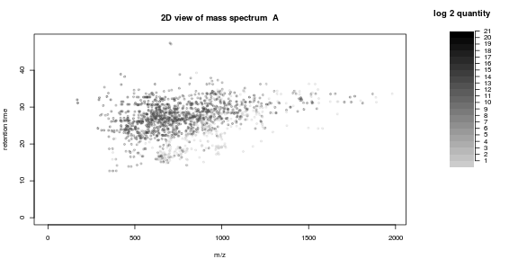 

```r
## The "pepmatched" object without identifications
view_spectra(schistocerca_tmab,matched,run=1)
```

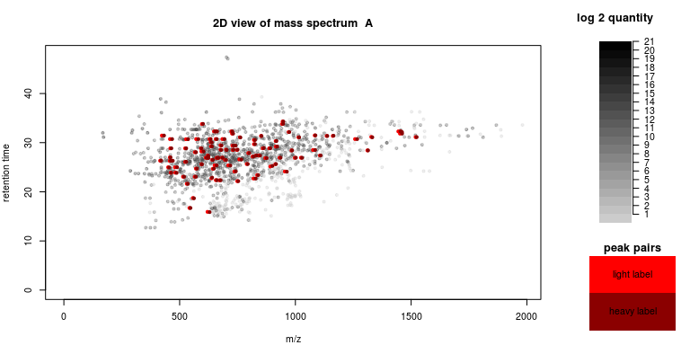 

```r
## The "pepmatched" object with identifications
view_spectra(schistocerca_tmab,matched_id,run=1)
```

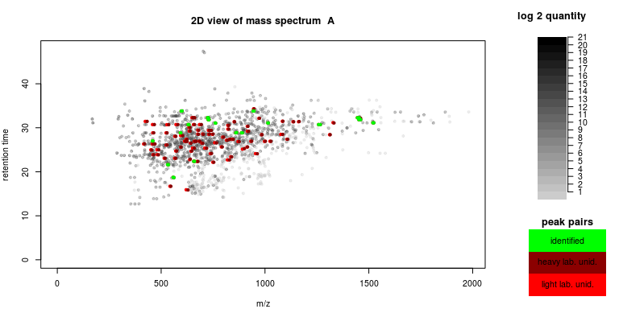 


## 6. Statistical analysis<a id="chapter-6"></a>
#### Generating a `statlist` object<a id="6.1"></a>
Now we have a list of peak pairs for each run, we want to know which peak pairs are significanlty different between conditions. To this end, we will transform our `pepmatched` object to the `statlist` object that is a very suitable format for statistical analysis. The `make.statlist` function will also log2-transform the data (other transformations can also be chosen) and discard peak pairs that have not been found in less than a given proportion of runs (standard all runs). Also all parameters for the trimming of the object can be given just like in `lpm_refine`. Notice that the quantmin and quantmax parameters are in original scale. It is however easy to give them in log2 scale (see example).


```r
statlist<-make.statlist  (                   
				pepmatched_object=matched_id,
				cutoff=1, # PROPORTION of runs in which a feature should be found to be retained in statlists. Default is 1
				logtransform=T,
				quantmin=2**8 # Minimum quantity for most abundant peak of a peak pair. Cuts them off on 8 in log2 scale. 
				)
```

#### Looking at the `statlist` object<a id="6.2"></a>
The statlist object contains four matrices with a column for every run and a row for every feature. The first two matrices are organized according to label. The last two matrices are organized according to condition. The metadata and design are placed apart from the real data.

<a id="linkbacktoboxplots"></a>

```r
lpm_summary(statlist, graphics = T)
# 
#        Object of class "lpm_statlist" with 8 runs and 81 features
#        -----------------------------------------------------------------
# 
# Summary of light labelled peptides per run:
#             A     B     C     D     E     F     G     H
# Min.    11.74 12.42 12.69 12.47 11.63 11.84 11.40 11.53
# 1st Qu. 14.06 13.90 15.02 14.85 15.02 14.73 13.10 14.66
# Median  15.08 15.29 16.05 16.34 15.70 15.78 14.97 15.76
# Mean    15.23 15.25 16.13 16.22 15.86 15.74 14.91 15.73
# 3rd Qu. 16.48 16.39 17.13 17.24 17.01 16.73 16.03 16.97
# Max.    18.76 18.38 19.90 20.69 19.54 19.59 19.46 19.43
# 
# Summary of heavy labelled peptides per run:
#             A     B     C     D     E     F     G     H
# Min.    11.20 11.39 11.46 11.07 11.03 11.58 11.07 11.22
# 1st Qu. 13.05 12.95 13.48 13.58 13.27 12.73 12.67 12.96
# Median  13.69 13.78 14.19 14.50 14.06 13.57 14.06 13.98
# Mean    13.96 13.92 14.49 14.79 14.34 13.81 14.16 14.26
# 3rd Qu. 14.99 14.82 15.50 15.79 15.44 14.77 15.45 15.34
# Max.    17.84 18.46 18.62 18.67 19.57 18.72 19.30 19.04
# 
# Summary of sol condition per run:
#             A     B     C     D     E     F     G     H
# Min.    11.74 12.42 11.46 11.07 11.63 11.84 11.07 11.22
# 1st Qu. 14.06 13.90 13.48 13.58 15.02 14.73 12.67 12.96
# Median  15.08 15.29 14.19 14.50 15.70 15.78 14.06 13.98
# Mean    15.23 15.25 14.49 14.79 15.86 15.74 14.16 14.26
# 3rd Qu. 16.48 16.39 15.50 15.79 17.01 16.73 15.45 15.34
# Max.    18.76 18.38 18.62 18.67 19.54 19.59 19.30 19.04
# 
# Summary of greg condition per run:
#             A     B     C     D     E     F     G     H
# Min.    11.20 11.39 12.69 12.47 11.03 11.58 11.40 11.53
# 1st Qu. 13.05 12.95 15.02 14.85 13.27 12.73 13.10 14.66
# Median  13.69 13.78 16.05 16.34 14.06 13.57 14.97 15.76
# Mean    13.96 13.92 16.13 16.22 14.34 13.81 14.91 15.73
# 3rd Qu. 14.99 14.82 17.13 17.24 15.44 14.77 16.03 16.97
# Max.    17.84 18.46 19.90 20.69 19.57 18.72 19.46 19.43
# 
# Summary of ligth - heavy labelled peptides per run:
#            A     B    C    D     E    F    G    H
# Min.    0.54  1.03 1.23 1.40  0.60 0.26 0.33 0.31
# 1st Qu. 1.01  0.95 1.54 1.27  1.75 2.00 0.43 1.70
# Median  1.39  1.51 1.86 1.84  1.64 2.21 0.91 1.78
# Mean    1.27  1.33 1.64 1.43  1.52 1.93 0.75 1.47
# 3rd Qu. 1.49  1.57 1.63 1.45  1.57 1.96 0.58 1.63
# Max.    0.92 -0.08 1.28 2.02 -0.03 0.87 0.16 0.39
# 
# Summary of sol - greg condition per run:
#            A     B     C     D     E    F     G     H
# Min.    0.54  1.03 -1.23 -1.40  0.60 0.26 -0.33 -0.31
# 1st Qu. 1.01  0.95 -1.54 -1.27  1.75 2.00 -0.43 -1.70
# Median  1.39  1.51 -1.86 -1.84  1.64 2.21 -0.91 -1.78
# Mean    1.27  1.33 -1.64 -1.43  1.52 1.93 -0.75 -1.47
# 3rd Qu. 1.49  1.57 -1.63 -1.45  1.57 1.96 -0.58 -1.63
# Max.    0.92 -0.08 -1.28 -2.02 -0.03 0.87 -0.16 -0.39
```

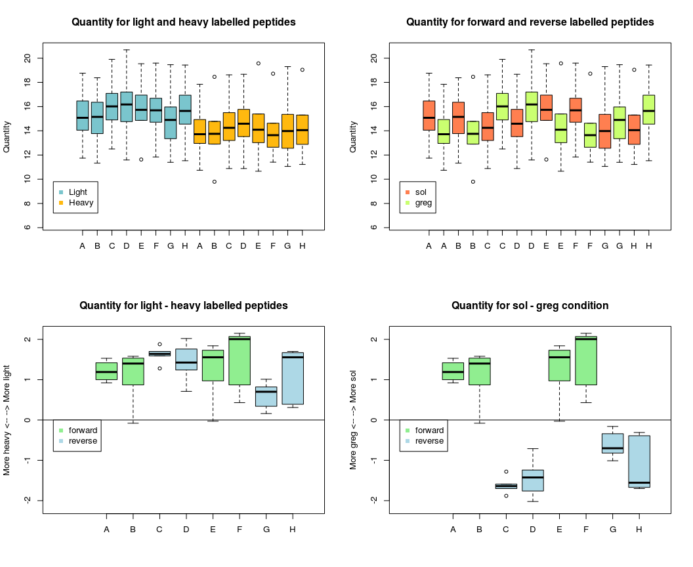 

Here again, we observe a clear difference in quantity between light and heavy labelled peptides, but no overall trends between the conditions. This is a typical picture that is seen in many high throughput technologies: most features show no difference, and there might be a "channel"" effect (e.g. in micro array studies, a dye effect). As long as the experimental design is balanced (i.e. with the labelling directions equally distributed over conditions), this should be no problem. Either, the label effect can be normalized, or label effect can be added as a covariate in a linear model. 

#### MA-plots<a id="MAplot"></a><a id="6.3"></a>
The statlist object can also be visualized with MA-plots. These are plots of the difference in quantity versus the average quantity per feature. The lpm_MAplot also draws a loess fit on the figures. 


```r
lpm_MAplot(statlist, loess_span = 1)
```

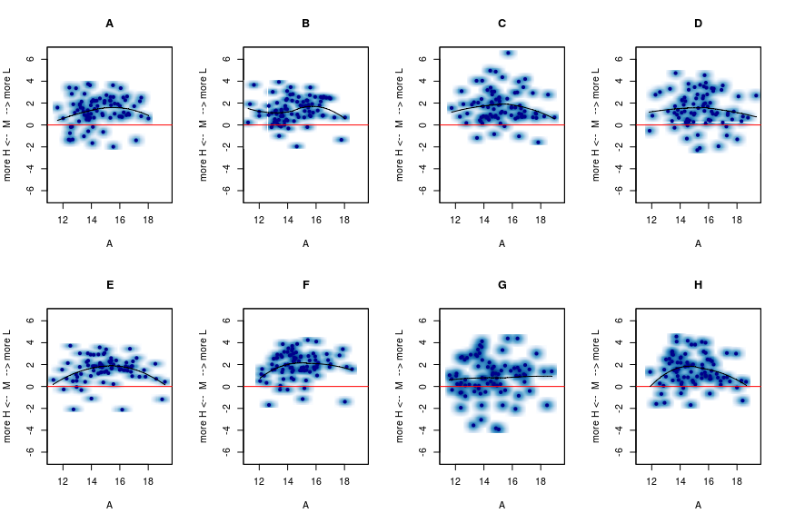 
When we compare all runs, we consistently observe the same overall label bias, but the structure of the bias along A-axis seems more or less random. This suggests that the label effect is not dependent on quantity. 


#### Linear models for comparing peptidomes<a id="6.4"></a>
The `lpm_linearmodel` function contains two methods. The "vanilla" method runs a separate mixed model on each feature, using label effect as a covariate and run as a random effect. This method is quick, and powerful given enough replicates. It is also the preferred method if previous normalizations have been applied to account global or run-specific label effects. The "complexmixed" method is a mixed model ran on all features at once, with label effect nested in run as a covariate. This method is extremely powerful, but calculation times rise quickly, and hence it is only possible to use on a limited number of features (e.g. only mass matched features, only highest quantities etc.). The time complexity is estimated to be quasipolynomial $n^{log(n)}$, and it is advised not to use this method for more than 50 features.
We will here focus on the use of the "vanilla" method. Don't forget to correct for multiple testing. Here, we use the Benjamini Hockberg procedure, but other multiple testing correction methods are also present. 


```r
model <- lpm_linearmodel(statlist, method = "vanilla", p.adjust.method = "BH", 
    cores = 1)
```
The `lpm_linearmodel` function outputs an object of class `lpm_linearmodel` that contains a data frame with all the model estimates and p-values per feature. 

```r
summary(model)
#        Length Class      Mode
# model  46     data.frame list
# design  5     data.frame list
knitr::kable(head(model$model, 3), digits = 3)
```


|            | pval.adj|     FC| pval| logpval| labelpval| labelbeta| SW_normality| SW_pval| Cooks|samplename_L |  ID_L| z_L|    mz_L|  ret_L|      m_L|samplename_H |  ID_H| z_H|    mz_H|  ret_H|      m_H|       MW| labelcount| precision|isID  |pepID    |pepseq          |  pepmass| delta_m| N_identifications| labelresidsolA| labelresidsolB| labelresidsolC| labelresidsolD| labelresidsolE| labelresidsolF| labelresidsolG| labelresidsolH| labelresidgregA| labelresidgregB| labelresidgregC| labelresidgregD| labelresidgregE| labelresidgregF| labelresidgregG| labelresidgregH|
|:-----------|--------:|------:|----:|-------:|---------:|---------:|------------:|-------:|-----:|:------------|-----:|---:|-------:|------:|--------:|:------------|-----:|---:|-------:|------:|--------:|--------:|----------:|---------:|:-----|:--------|:---------------|--------:|-------:|-----------------:|--------------:|--------------:|--------------:|--------------:|--------------:|--------------:|--------------:|--------------:|---------------:|---------------:|---------------:|---------------:|---------------:|---------------:|---------------:|---------------:|
|36145_36143 |    0.001| -1.216|    0|   4.771|         0|    -1.232|        0.980|   0.961| 0.604|NA           | 36145|   2| 530.813| 21.630| 1059.611|NA           | 36143|   2| 535.342| 21.630| 1068.670|  932.503|          1|     0.003| TRUE |Scg-PK-4 |EGDFTPRLa       |  932.476|  -0.026|                 1|          0.047|          0.068|          0.563|          0.785|         -0.304|          1.304|          0.892|          1.509|          -1.328|          -1.284|           0.034|          -0.584|          -0.830|          -0.307|          -0.750|           0.186|
|544_1384    |    0.003| -0.852|    0|   4.027|         0|    -1.258|        0.972|   0.872| 0.788|NA           |   544|   4| 760.171| 31.173| 3036.656|NA           |  1384|   4| 762.440| 31.141| 3045.731| 2909.556|          1|     0.020|FALSE |NA       |NA              |       NA|      NA|                 0|          0.020|          0.705|          0.351|          0.914|          0.366|          0.667|         -0.301|          0.686|          -0.621|          -0.415|          -0.217|          -0.105|           0.167|          -0.782|          -1.231|          -0.204|
|271_36140   |    0.003| -0.918|    0|   3.880|         0|    -1.400|        0.935|   0.291| 0.588|NA           |   271|   3| 591.664| 28.896| 1771.971|NA           | 36140|   3| 594.688| 28.896| 1781.043| 1644.869|          1|     0.017| TRUE |Scg-PK-5 |DSSEDWAQPFVPRLa | 1644.794|  -0.074|                 1|         -0.109|          0.182|          0.353|          1.227|          0.485|          0.357|          0.462|          0.716|          -0.987|          -1.192|           0.043|           0.305|           0.246|          -0.824|          -0.773|          -0.490|


#### Visualizing the statistics after analysis<a id="6.5"></a>
The standard way for visualisation of this kind of data is a volcano plot. Here, the negative of the base 10 logarithm of the p-value is plotted on the log2 fold change. The `lpm_volcanoplot` has an interactive mode (`plotlocator=T`) where feature IDs are printed in the terminal when clicking on them in the plot. This is a quick way of getting a grasp on which features to investigate in more detail. For now, we will just print the volcanoplot without the locator function. 


```r
lpm_volcanoplot(model, plotlocator = F)
```

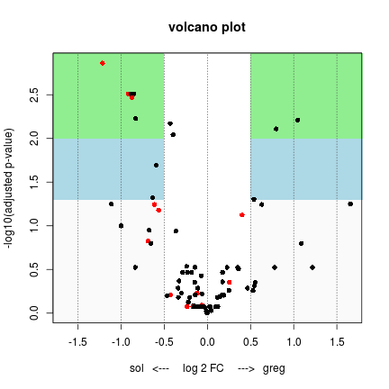 
<br/>
Features in the blue zone have a corrected p-value lower than 0.05, features in the green zone have a corrected p-value lower than 0.01. Red dots indicate features with identifications through mass match. For more information on the interpretation of this specific volcanoplot, we refer to Verdonck et al. 

<br/>
Another nice way to visualize these data is through a heatmap. Here, we make a heatmap for all features that correspond to the standard cutoffs in the function: p value lower than 0.05, adjusted p value lower than 0.05, and (non transformed) fold change higher than 1.25 (25% up or downregulation). 

<br/>
Remember that we sometimes have to cope with label effects. Hence, a heatmap with just raw quantities (or their contrasts) would probabily not tell you much (remember [these](#linkbacktoboxplots) boxplots). On that account, it is much more interesting to either look at normalized data, or at contrasts of a linear model. The bioconductor package [limma](#chapter-8), to which this package links through the `lpm_make.RGList` function, offers numerous features for normalization. Within the labelpepmatch function however, we concentrate on linear models to cope with this issue. Accordingly, the `lpm_heatmap` function uses the residuals of the "null model" of the `lpm_linearmodel`. This is a linear model with "label" as a main effect, without accounting for "treatment". The lpm_heatmap function can be applied both on the raw residuals or on the contrasts within one peak pair. 


```r
lpm_heatmap(model, FCcutoff = 1.25, main = "HM on residuals")
```

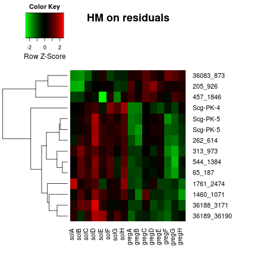 


```r
lpm_heatmap(model, FCcutoff = 1.25, contrasts = T, main = "HM on res. contrasts")
```

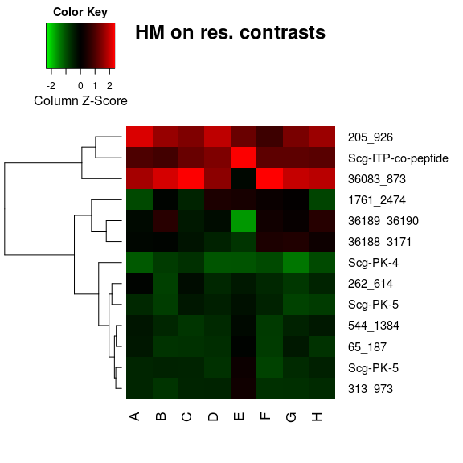 

Looking at either of these heatmaps, one would not be able to infer the labeling direction of different replicates. This would be different if we were to make a heatmap using the raw quantities. In other words: the label effect has been effectively cancelled out by using the residuals of the linear model. Also, it is clear that using the above mentioned cutoffs, we observe 3 times more upregulations in solitarious than in gregarious locusts. This is an observation we already made looking at the volcano plot, but here we get a more detailed view on the most interesting features. 

For example, when we look at the constrast heat map, we clearly see that not all differences are equally homogeneous. But, nothing in biology is ever completely black and white (or red and green for that matter). Even more interestingly, the clustering dendrograms left to the heatmap shows us that some features show remarkable similarities in their patterns over different runs. For example, there is one "clade" where we see pyrokinin 5 popping up twice, and on top of that, some other features that show remarkable similarities. In order to take a closer look in this cluster, we only take the subset of our linear model that contains these features. 


```r
### Note to self: Hier is een aanpassing nodig: ik wil eigenlijk de eerste
### code uitvoeren maar aangezien de 'isID' kolom NA's geeft ipv iets in de
### aard van 'unknown' lukt dat niet. Ik ga dit aanpassen in het
### identificatiescript (of vroeger), maar moet vervolgens controleren of de
### pipeline nergens anders clasht.  Vermoedelijk niet, behalve mss in heatmap
### functie.  model$model[rownames(model$model) %in%
### c('347_954','65_195','524_1514','210_535') | model$model$pepID ==
### 'Scg-PK-5' ,c(18,22,23,26,27)]
model$model[rownames(model$model) %in% c("347_954", "65_195", "524_1514", "210_535", 
    "217_538", "8337_86"), c(18, 22, 23, 26, 27)]
# [1] z_H        MW         labelcount pepID      pepseq    
# <0 rows> (or 0-length row.names)
```

This closer look gives away that we are actually looking at only 3 different peptides, with charges ranging between 2 and 4. Most probabily, since the patterns of expression for the 1644 Da and the 2909 Da peptides align so well, we are looking at a longer isoform or precursor of the Scg-PK-5 peptide. 


## 7. Further analysis with Bioconductor limma<a id="chapter-7"></a>
#### Bioconductor limma<a id="7.1"></a>
Labelled peptide data look a lot like microarray data: comparison of two samples within one run, dye/label swap, matched features between runs etc. This is the reason why labelpepmatch links to Bioconductor limma: a package for data analysis, linear models and differential expression for microarray data. If one wants to take the analysis further than the linear models offered by labelpepmatch (e.g. Bayesian estimation of variance, different kinds of normalisations etc.), limma is a very good extension to our pipeline. Also, it allows for a broad range of experimental designs. 

```r
library(limma)
```


#### Linking labelpepmatch to limma<a id="7.2"></a>
Since limma is a very elaborate package, a detailled overview of every function is beyond the scope of this vignette. However, we here give a basic pipeline that can serve as a starting point for further exploration. Many of the limma functions can be applied directly to our data once in the right format. We start by converting our `statlist` object to a limma `RGList` object. 


```r
RG1 <- lpm_make.RGList(statlist)
summary(RG1)
#         Length Class      Mode   
# R       648    -none-     numeric
# G       648    -none-     numeric
# Rb      648    -none-     numeric
# Gb      648    -none-     numeric
# genes     2    data.frame list   
# targets   6    data.frame list
knitr::kable(head(RG1$R))
```


|            |      A|      B|      C|      D|      E|      F|      G|      H|
|:-----------|------:|------:|------:|------:|------:|------:|------:|------:|
|36212_36213 | 116024| 112536| 111252|  54176| 192316|  35112|  37644|  55584|
|36056_36057 | 324800| 341052| 651596| 565816| 684764| 655308| 723340| 471500|
|36050_36285 | 142104| 121420| 298784| 246640| 313028| 268124| 258608| 182780|
|36054_36053 |  72696|  65208| 143920| 146384| 166268| 138832| 153808|  93200|
|36070_36071 | 143180| 124328| 265376| 228068| 232064| 235380| 154376| 140480|
|36058_36059 |  89072| 140664| 134048| 168468| 343804| 164996| 196600| 220812|

```r
knitr::kable(head(RG1$Rb))
```


|            |  A|  B|  C|  D|  E|  F|  G|  H|
|:-----------|--:|--:|--:|--:|--:|--:|--:|--:|
|36212_36213 |  0|  0|  0|  0|  0|  0|  0|  0|
|36056_36057 |  0|  0|  0|  0|  0|  0|  0|  0|
|36050_36285 |  0|  0|  0|  0|  0|  0|  0|  0|
|36054_36053 |  0|  0|  0|  0|  0|  0|  0|  0|
|36070_36071 |  0|  0|  0|  0|  0|  0|  0|  0|
|36058_36059 |  0|  0|  0|  0|  0|  0|  0|  0|

```r
knitr::kable(RG1$targets)
```


| RunNumber|Samplenames |FileName                                      | RunNumber|Cy3  |Cy5  |
|---------:|:-----------|:---------------------------------------------|---------:|:----|:----|
|         1|A           |exported_featuredata_schistoTMAB2011_2015.csv |         1|greg |sol  |
|         2|B           |exported_featuredata_schistoTMAB2011_2015.csv |         2|greg |sol  |
|         3|C           |exported_featuredata_schistoTMAB2011_2015.csv |         3|sol  |greg |
|         4|D           |exported_featuredata_schistoTMAB2011_2015.csv |         4|sol  |greg |
|         5|E           |exported_featuredata_schistoTMAB2011_2015.csv |         5|greg |sol  |
|         6|F           |exported_featuredata_schistoTMAB2011_2015.csv |         6|greg |sol  |
|         7|G           |exported_featuredata_schistoTMAB2011_2015.csv |         7|sol  |greg |
|         8|H           |exported_featuredata_schistoTMAB2011_2015.csv |         8|sol  |greg |

Note that in the limma syntax, the two channels are called "red" (corresponds to cy5) and "green" (corresponds to cy3). And, for consistency reasons, we will always call the light channel "red" and the heavy channel "green". (note to self: nakijken, volgens mij doet het script het nog niet consistent nu)Since our mass spectrum does not really have a background signal, the background matrices are zero matrices. 

Next, we turn this object in an `MAList` object and plot

```r
MA1 = MA.RG(RG1, bc.method = "subtract", offset = 0)
summary(MA1)
#         Length Class      Mode   
# genes     2    data.frame list   
# targets   6    data.frame list   
# M       648    -none-     numeric
# A       648    -none-     numeric
limma::plotMA(MA1, array = 1)
```

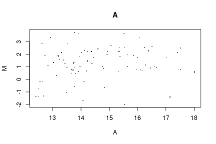 

#### Within run normalisation<a id="7.3"></a>

In the MA plots there should be no systematic trends as a function of quantity: most genes should lie around zero. If we notice a trend along the A axis, or a systematic bias, we can execute a couple of normalisations within runs. 


```r
MA2 = normalizeWithinArrays(RG1, method = "robustspline", bc.method = "none")
# Loading required package: MASS
# Loading required package: splines
# method='loess' for loess normalisation, this is if label effects are
# quantity dependent, if this is not the case use 'median', 'robustspline'
# can be alternative for 'loess'
RG2 = RG.MA(MA2)
# these would be the corresponding normalised R and G values backtransformed
# onto the original scale
limma::plotMA(MA2, array = 1)
```

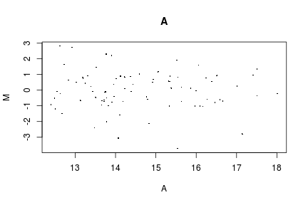 


#### Between run normalisation<a id="7.4"></a>

To make the different runs as comparable as possible, we can also apply between array normalisations. Two common normalisations are the quantile and Aquantile normalisations. Quantile normalisation will ensure that the quantities will have the same empirical distribution across all arrays and channels, and Aquantile normalisation will ensure that the A-values (average quantities) will have the same empirical distribution across runs while leaving the M-values (log-ratios) unchanged. Let's do the Aquantile normalisation here:


```r
MA3 = normalizeBetweenArrays(MA2, method = "quantile")
# most drastic normalisation would be 'quantile', 'Aquantile' would be less
# drastic
RG3 = RG.MA(MA3)
# these would be the corresponding normalised R and G values backtransformed
# onto the original scale

# DIAGNOSTIC PLOTS: let's see how the Aquantile normalisation affects the
# distribution of the R and G intensities:
par(mfrow = c(2, 3))  # now we make a grid with 1 row and 3 columns
plotDensities(RG1)  # raw, Agilent preprocessed R and G intensities
plotDensities(RG2)  # after loess within-array normalisation
plotDensities(RG3)  # after loess+Aquantile between-array normalisation

plotDensities(MA1)  # raw, Agilent preprocessed R and G intensities
plotDensities(MA2)  # after loess within-array normalisation
plotDensities(MA3)  # after loess+Aquantile between-array normalisation
```

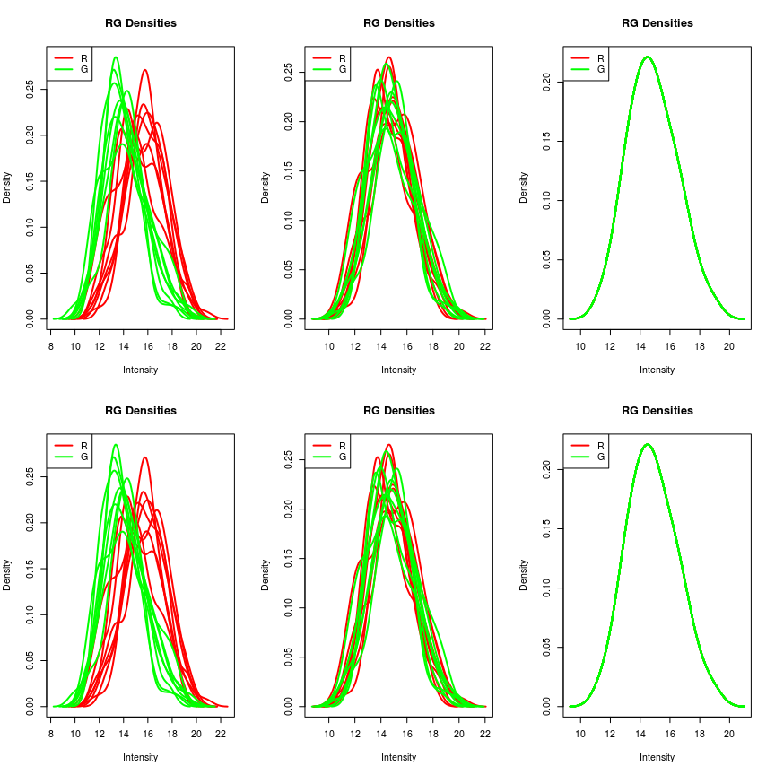 

Notice how the two "channels" are normalized towards each other. This is a very powerful normalization and it should be emphasized that this is probabily not necessary in every situation. (Tom, jij hier misschien nog wat info over? )

Now we know how to create an RG list object and normalize it, there are ample possibilities for linear models on the data. In what follows, we will give some pointers without printing all the output. For more information, the reader is referred to the limma manual. 


```r

design = model.matrix(as.formula("~ Cy3"), data = RG2$targets, contrasts = list(Cy3 = "contr.sum"))[, 
    2]
fit = lmFit(MA2, design, ndups = 1, block = NULL)
fit.eb = eBayes(fit, proportion = 0.1)
stats = topTable(fit.eb, coef = 1, number = 100, adjust.method = "BH", genelist = fit$genes, 
    sort.by = "p")
knitr::kable(head(stats), digits = 3)
```


|            |ID          |Name     |  logFC| AveExpr|      t| P.Value| adj.P.Val|     B|
|:-----------|:-----------|:--------|------:|-------:|------:|-------:|---------:|-----:|
|205_926     |205_926     |unknown  | -0.801|  14.649| -4.054|   0.003|     0.091| 1.137|
|36145_36143 |36145_36143 |Scg-PK-4 |  0.799|  17.150|  4.043|   0.003|     0.091| 1.123|
|1761_2474   |1761_2474   |unknown  |  0.736|  12.482|  3.866|   0.003|     0.091| 0.886|
|271_36140   |271_36140   |Scg-PK-5 |  0.808|  14.906|  3.494|   0.006|     0.099| 0.376|
|283_1264    |283_1264    |unknown  | -0.639|  14.239| -3.401|   0.007|     0.099| 0.245|
|36015_127   |36015_127   |Scg-PK-5 |  0.566|  17.239|  3.340|   0.008|     0.099| 0.159|


<br/>
<br/>
<br/>
<br/>
<br/>
<br/>
<br/>
<br/>
<br/>
<br/>
<br/>
<br/>
<br/>
<br/>
<br/>
<br/>


